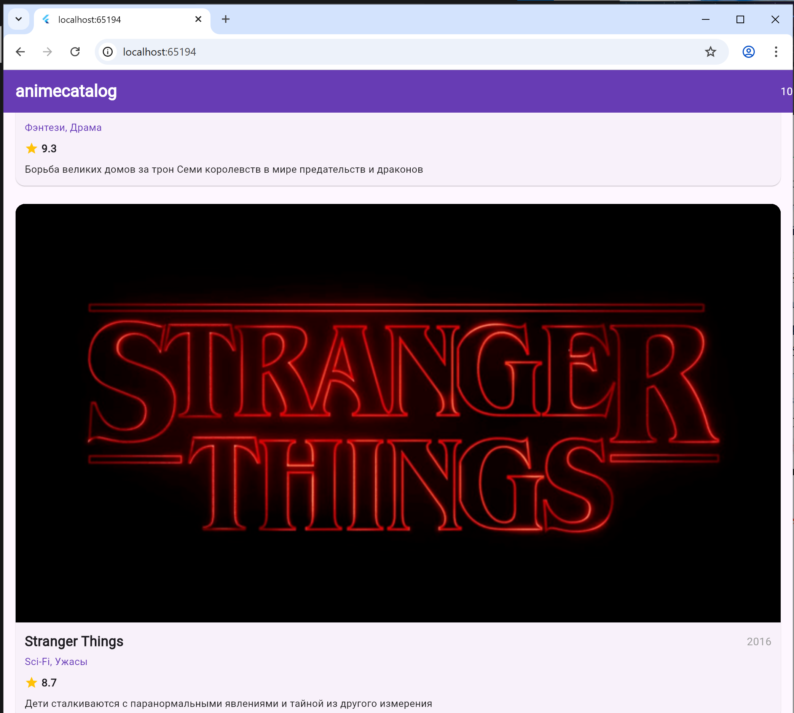

# Лабораторная работа 4

это приложение -каталог карточек аниме и сериалов на flutter


## Информация об авторе:
Кузнецов А Вахрушева А ИСП-233 


## Что изучили:

-ListView.builder
-Model of data in Flutter
-ScaffoldMessenger.of(context) 


## Скриншот приложения:




## Как запустить

Склонируйте репозиторий командой 

```
git clone https:...(этот репозиторий)
```

в терминале пропишите 

```
flutter run -d chrome
```


